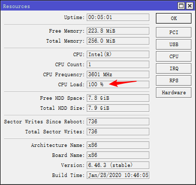

### CVE-2020-20217

#### Description

The `route` process suffers from an uncontrolled resource consumption vulnerability. By sending a crafted packet, an authenticated remote user can cause a high cpu load, which may make the device respond slowly or unable to respond.

Against stable `6.46.3`, the poc resulted in the high cpu load on the device.

#### Affected Version

This vulnerability was initially found in long-term  `6.44.6`, and was fixed in stable `6.47`.

#### Timeline

+ 2019/12/02 - reported the vulnerability to the vendor
+ 2019/12/03 - vendor reproduced and confirmed the vulnerability
+ 2021/05/04 - CVE was assigned

